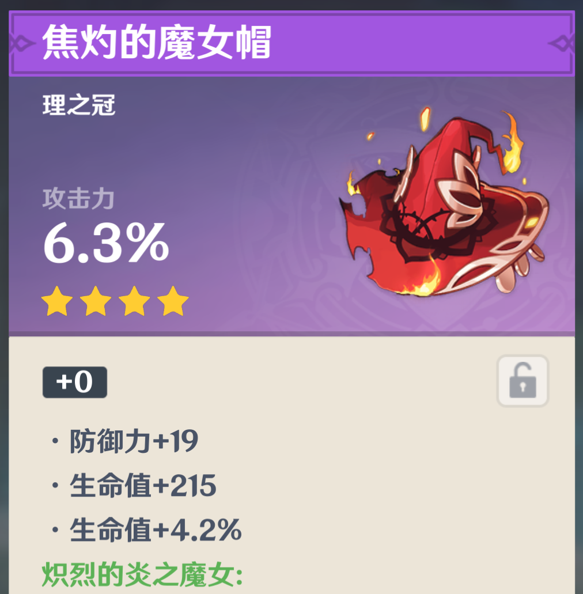

# genshin-ocr
 OCR for Genshin Impact artifacts

开发中

# Demo
粘贴(ctrl-v)一张长这样的截图到[这个网站](https://mr-quin.github.io/genshin-ocr), 进度显示在控制台里

必须是背包节目的截图，不是人物界面

截图必须是从名字到套装名字

目前，由于ocr模型来自cdn，可能存在因为网络原因无法下载的情况

感谢 [genshin-optimizer](https://github.com/frzyc/genshin-optimizer) 提供的~~代码~~灵感
